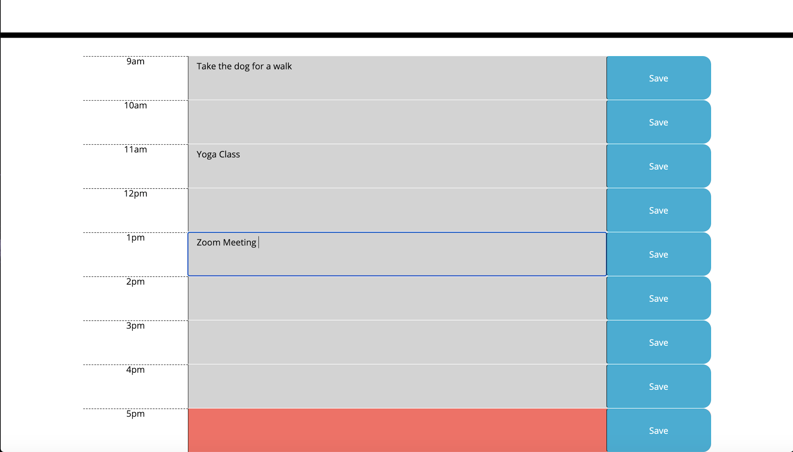

### Website Title and Description

Third-Party APIs: Work Day Scheduler

## Work Day Scheduler

Work Day Scheduler: A simple 9-5 calendar application that allows a user to save events for each hour of the day, My website has Bootstrap components and grid system. 


# How to access?

The website can be found at the following address: https://nikstar-1.github.io/work-day-scheduler-new/


# Usage

This website presents a workday: 9-5 shedule. The days are shown in hour time-blocks, each time-block is color coded to indicate whether the event occurs in the past, present or future.

 When the save button for each timeblock is triggered, the text input for that event is saved in local storage. Appointments, and other important events can be added to the daily planner
 
manage time more effectively. Using moment.js the past time slots will become greyed out as the day goes on. This app will run in the browser and feature dynamically updated HTML and CSS

powered by jQuery.

## User Story

```
AS AN employee with a busy schedule

I WANT to add important events to a daily planner

SO THAT I can manage my time effectively

```


## Acceptance Criteria

```
GIVEN I am using a daily planner to create a schedule

WHEN I open the planner

THEN the current day is displayed at the top of the calendar

WHEN I scroll down

THEN I am presented with time blocks for standard business hours

WHEN I view the time blocks for that day

THEN each time block is color-coded to indicate whether it is in the past, present, or future

WHEN I click into a time block

THEN I can enter an event

WHEN I click the save button for that time block

THEN the text for that event is saved in local storage

WHEN I refresh the page

THEN the saved events persist

```


# Motivation

As someone who benefits from a structured schedule it's useful to have something you can keep updating throughout the day. 

# Moving forward

I'd like to add more to my calender like extra features.


# Credits

*Google 

*w3schools.com

*github.com

*stackoverflow.com

*[Moment.js](https://momentjs.com/)


## Screenshots:

**Work Scheduler Main.**


**Work Schedule complete page.**




--------------------------------------------------------------------------------------------------------------------------------------------------------------------------------------

